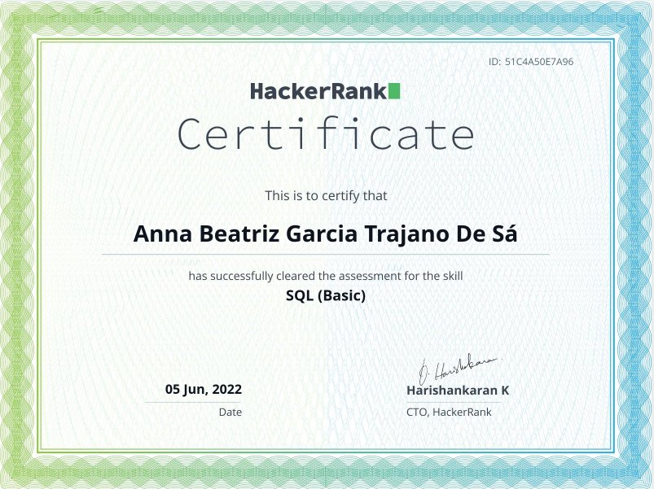

Este repositório contém os exercicios realizados por _[Anna Beatriz Garcia Trajano de Sá](www.linkedin.com/in/anna-beatriz-trajano-de-sá)_ enquanto estudava na [Trybe](https://www.betrybe.com/) :rocket:

# Exercícios de SQL: Rumo a Gold Badge (HackerRank - SQL) ⭐

Exercícios destinados a aprimorar conceitos relacionados a Banco de Dados!

Como base tive como inspiração a série do canal Tecnologia em Video (Gustavo Caetano) e os exercícios do HackerRank.

## Gold Badge Conquistada!

Em andamento...

## Certificados

Certificate             |         
:-------------------------:|
  |

## Habilidades Desenvolvidas

Nestes exercícios, aprimorei as seguintes habilidades:

 - Banco de dados;
 - SQL.

 
 ## Referências
 [MySQL - Tecnologia em Vídeo](https://youtu.be/v3mka6By8LA) 
 [HackerRank](https://www.hackerrank.com) 
